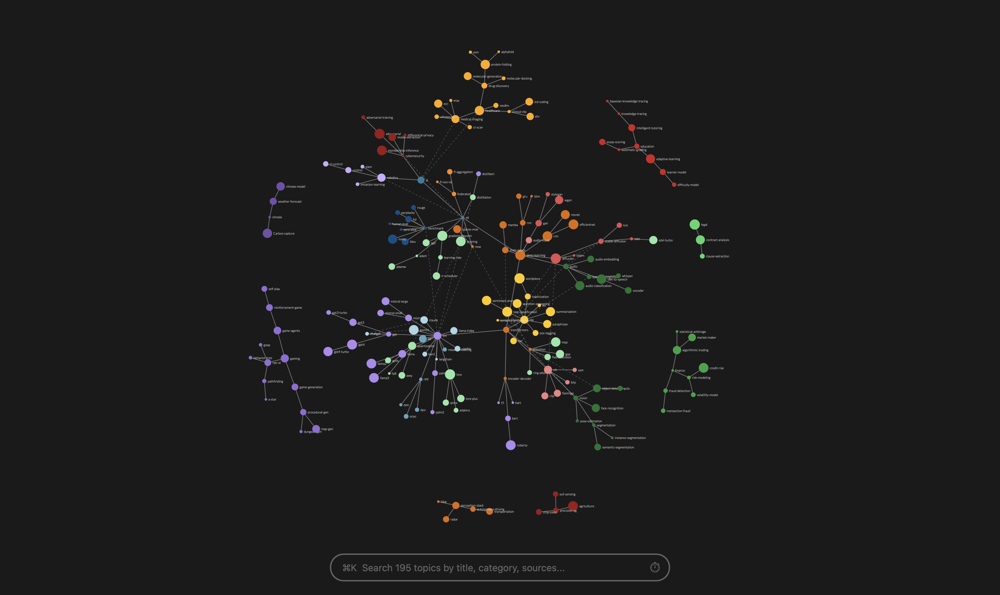

# Cobrain

Cobrain CLI helps AI agents gather, organize and visualize owner's knowledge in a local vault: files (topics, sources) + graph (structured metadata).

- Vault locally stores and organizes knowledge, tracks learning, and creates persistent shared context between owner/user/agent for collaboration and decisions
- Agent manages vault autonomously
- Cobrain CLI performs deterministic tasks and helps AI agent perform vault-related tasks reliably and token-efficiently



## Who Cobrain is for

**Personal Use**
- Heavy X users who want a context-rich backup of full conversations/articles/bookmarks/likes that's easy to digest and search
- People who want an effortless way to map out their knowledge and learning progress across multiple sources (ChatGPT, X, AI chats, internet, local files)
- Users of AI agents like Claude/Codex/OpenClaw/Hermes who want them to be more personalized and up to date with their constantly evolving needs and interests

**Work & Projects**
- People/agents collaborating on a project and needing shared, persistent, high-signal context
- Developers building AI agents who need simple plug-and-play knowledge management

## Why Cobrain?

| | Agent + Cobrain | Agent Alone | Agent + Obsidian |
|-----------|-----------------|-------------|------------------|
| **Token Efficiency** | Best - CLI optimizes entire agent workflow | Worst - use only shell+files or code own tools | Worse - built for humans / MCP |
| **Setup** | Simplest - install skill | Simple - API key + custom AGENTS.md | From OK to Complex |
| **Source Integrations** | Best - ChatGPT + X built-in | Worst - custom code only | Worse - varies by solution |
| **Visualization** | Good - portable single-page vault.html (D3js) | Worst - optional external | Best - great plugins (excellent) |
| **Ease of Use (Agent)** | Best - agent-native design + skill | Worst - starts with no tools/guidelines | Worse - built for humans |

## Features

- **Fully Agent-Managed** - Human just talks to their agent (OpenClaw, Hermes, Claude Code, Codex etc.); agent autonomously ingests sources, creates/updates topics, finds info, maintains graph, runs health checks
- **Built-in Source Integrations** - X + ChatGPT ready to ingest with one command
- **Context-Rich X Conversations** - Pull full conversations up to original post/article
- **Token-Efficient Agent Workflow** - CLI/skill guide and optimize agent's work and token usage, health check tooling & guidelines
- **Graph Visualization** - `vault.html` for humans: interactive color-coded graph, instant search/filter, keyboard shortcuts, "copy selection (incl. hierarchy)" to refer/discuss with agent
- **Local-First & Portable** - On-device, portable and self-contained `vault/` folder, multiple vaults supported (e.g. per project, personal/work), standalone sharable `vault.html`
- **Light & Customizable** - ~5K LOC, no dependencies/frameworks, easy customization by agent

## Installation & Setup

Install agent skill in your harness: [skills/cobrain-vault](skills/cobrain-vault). Agent does the rest.

Alternative:
```bash
pip install cobrain
cd <vault-path>
brn init  #  creates vault structure below
```

Multiple vaults (per project, personal/work) supported with distinct vault-local config.

## Vault

```
vault/
├── topics/               # topic files (.md), source of truth for CLI
├── sources/
│   ├── chats/            # ChatGPT conversations (.md)
│   ├── x/                # X conversations (.yaml)
│   └── ...               # add more for other sources
├── vault.html            # standalone shareable page with search/filters for human user
├── AGENTS.md             # custom instructions and persistent notes for agent
└── .cobrain/             # app internals, read but never edit directly
    ├── config            # used to detect vault
    ├── vault.yaml        # derived graph of topics, with metadata
    ├── categories.yaml   # customizable topic category colors / titles
    ├── backups/          # rolling backups
    ├── diffs/            # diffs from backups
    └── logs/             # ingest logs
        ├── chatgpt/
        └── x/
```

`vault/` is self-contained and portable.
`vault/sources/`: raw content ingested from external systems (ChatGPT, X, user-provided documents, your own chat with user), users never read this.
`vault/topics/`: curated summaries users read, source of truth for everything.

## CLI reference

```bash
brn version                        # show version
brn init                           # initialize vault in current directory
brn sync [--warnings]              # build graph from files + show warnings
brn show                           # build and open vault.html in browser
brn vault [--ids <ids>] [--minimal | --full | --full+] [--flow | --block]  # get graph as YAML (select ids, topic metadata fields, YAML format)
brn vault --ids <ids> --set field=value...  # update topic frontmatter + sync
brn vault --from <id> [--depth N]  # subtree
brn vault --from <id> --to <id2>   # shortest path (parent links only)
brn sources [--warnings]           # view source stats + warnings
brn sources --ingest chatgpt --paths <path...> [--since <dt>] [--until <dt>] [--titles <titles]>  # ingest ChatGPT conversations.json
brn sources --ingest x --ids <post_ids>  # ingest X posts by ID/URL/xurl
brn sources --ingest x --own [--count <N> | --new | --since-id <id> --until-id <id>]  # fetch own posts (default 10, count, all new until hit existing, or target range)
brn sources --ingest x --own --authorization-code <code>  # first-time X auth
brn sources --ingest x --likes [--count <N> | --new]  # ingest liked posts
brn sources --ingest x --bookmarks [--count <N> | --new]  # ingest bookmarked posts
brn backup                         # copy vault.yaml + categories.yaml (up to 20)
```

All `--ingest x` commands pull full conversation above the target post, and minimize API credits spent by always checking locally stored posts first.

## Topics

Agent creates `vault/topics/topic.md` with YAML frontmatter, based on sources. Topics are source of truth for everything.

## Sources

X and ChatGPT: integrated, agent ingests with CLI command.
Other sources (webpage, file, chat): agent reads directly.

### X

- Built with XDK (official X SDK), with their affordable [pay-per-use pricing](https://docs.x.com/x-api/getting-started/pricing) and 24h retrieved post caching to save your credits.
- Uses your own app's OAuth2.0 credentials.
- Ingest your bookmarks, likes, posts and replies, or any post by id/url. Official endpoint filters supported as flags.
- CLI automatically builds coherent conversations (one per file) from target post up to original (root) post. Locally stored posts are re-used whenever possible to save your credits. New posts from an existing conversation merge into the same file seamlessly.
- Output: `vault/x/<conversation_author>_<conversation_id>.yaml`.

### ChatGPT

- Request data export from your ChatGPT app and run ingest command on `conversations.json`.
- Filter by dates and title supported as flags.
- Output: `vault/chats/<title>.md`.

## License

MIT
